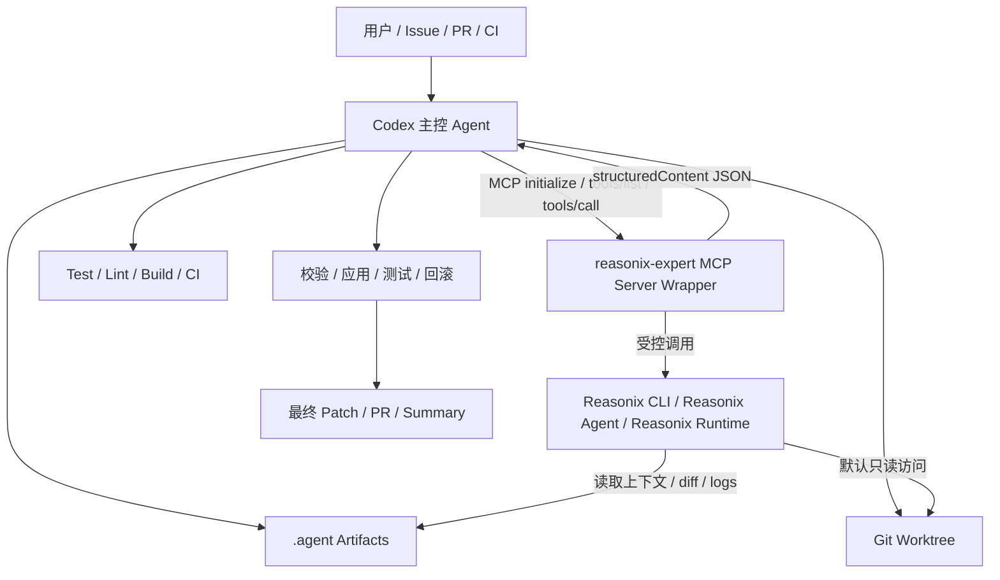
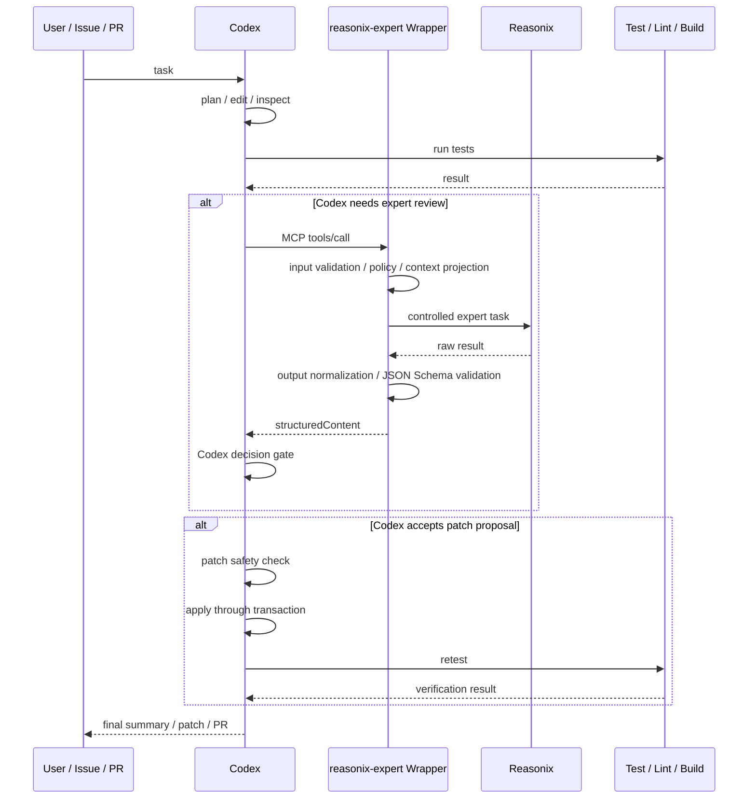

# Codex + Reasonix 多 Agent 编排系统设计文档
名称：Coasonix （Codex-Orchestrated Reasonix Runtime）
版本：v0.2  
核心模式：Codex-centered Expert Delegation Architecture  
更新重点：MCP 通信规范、Reasonix MCP Server Wrapper、结构化工具协议、失控防护规则

---

## 1. 文档目的

本文定义一套以 **Codex** 为主控 Agent、以 **Reasonix** 为专家子代理的多 Agent 编排系统。

系统目标不是让 Codex 与 Reasonix 平权聊天，而是建立一个可审计、可验证、可控权限、可回滚的专家委派体系：

```text
Codex = 主控 Agent / 任务编排器 / 代码执行者 / 最终裁决者
Reasonix = 专家工具 / 子代理 / 外部审查与推理模块
reasonix-expert MCP Server = Codex 与 Reasonix 之间的协议适配层
Git + CI = 事实源与验证层
MCP = 控制面协议
Git diff + 文件 + 日志 = 数据面载体
JSON Schema = 结果契约
```

本文档同时承担两类职责：

```text
规范设计文档：定义角色边界、通信模型、委派原则、安全边界和上下文所有权。
工程规格文档：定义工具契约、schema 要求、权限等级、路径约束、审计字段、错误处理和验证门槛。
```

当两类内容发生冲突时，工程实现必须优先满足安全边界、权限策略、schema 契约和审计要求。

---

## 2. 总体结论

本系统采用：

```text
Codex -> reasonix-expert MCP Server Wrapper -> Reasonix
```

而不是：

```text
Codex <-> Reasonix 直接互聊
```

也不是：

```text
Codex MCP Client -> Reasonix MCP Client
```

原因是：

1. Codex 适合作为 MCP Host / Client，连接外部 MCP Server。
2. Reasonix 当前更适合作为 MCP Client / 本地 coding agent / terminal agent。
3. 两个 MCP Client 不能直接用 MCP 通信。
4. 因此需要一个 `reasonix-expert` MCP Server Wrapper。
5. Wrapper 对 Codex 暴露标准 MCP tools。
6. Wrapper 内部以受控方式调用 Reasonix CLI、本地进程、API 或未来的 Reasonix controller。
7. Codex 接收 Reasonix 结构化结果后，负责验证、执行、测试和最终交付。

---

## 3. 核心架构



---

## 4. 角色定位

### 4.1 Codex：主控 Agent / 编排器 / 执行者

Codex 是系统唯一主控 Agent。

Codex 负责：

1. 理解用户任务。
2. 拆解任务。
3. 制定实现计划。
4. 修改代码。
5. 运行命令。
6. 执行测试。
7. 判断是否需要 Reasonix。
8. 准备 Reasonix 所需上下文。
9. 调用 `reasonix-expert` MCP tools。
10. 校验 Reasonix 输出。
11. 决定是否采纳 Reasonix 建议。
12. 应用 patch。
13. 回滚失败修改。
14. 生成最终交付说明。
15. 对最终结果负责。

Codex 不应：

1. 无限制调用 Reasonix。
2. 把 Reasonix 输出当成系统指令。
3. 让 Reasonix 修改上层策略。
4. 让 Reasonix 跳过测试。
5. 让 Reasonix 直接合并主分支。
6. 将 secrets、完整环境变量或生产凭据传给 Reasonix。
7. 允许 Reasonix 直接控制 Codex 的工作区。

---

### 4.2 Reasonix：专家工具 / 子代理 / 外部审查模块

Reasonix 是 Codex 按需调用的专家模块。

Reasonix 负责：

1. 架构分析。
2. 复杂 bug 推理。
3. 代码审查。
4. 安全审查。
5. 性能分析。
6. 并发风险分析。
7. 数据库迁移风险分析。
8. 测试策略建议。
9. 候选 patch 生成。
10. 第二意见审查。

Reasonix 不负责：

1. 最终执行任务。
2. 最终合并代码。
3. 修改主任务目标。
4. 修改 Codex 权限策略。
5. 扩大自身文件访问范围。
6. 直接执行生产命令。
7. 直接访问 secrets。
8. 直接控制 Codex。
9. 与 Codex 进行自由对话式协商。

---

### 4.3 reasonix-expert MCP Server Wrapper：协议适配层

`reasonix-expert` 是 Codex 与 Reasonix 之间的 MCP Server。

它负责：

1. 向 Codex 暴露 MCP tools。
2. 提供工具描述、`inputSchema`、`outputSchema`。
3. 接收 Codex 的 `tools/call`。
4. 校验输入参数。
5. 构造 Reasonix 专家任务。
6. 调用 Reasonix CLI / API / 本地进程。
7. 限制 Reasonix 权限。
8. 收集 Reasonix 输出。
9. 解析 Reasonix 输出为结构化 JSON。
10. 校验 JSON Schema。
11. 将结果通过 MCP `structuredContent` 返回给 Codex。
12. 记录审计日志。
13. 处理超时、错误和取消。

Wrapper 不应：

1. 自行扩大任务范围。
2. 自行访问 Codex 没有授权的文件。
3. 自行请求 secrets。
4. 自行调用 Codex sampling。
5. 自行持久修改主代码库。
6. 将 Reasonix 原始自由文本无校验地转发给 Codex。

---

## 5. 编排流程

本节合并原编排流程文档的语义。Coasonix 的标准流程是 Codex 先自主管理任务、代码、测试和验证；只有在需要专家审查、复杂推理、候选 patch 或测试策略时，才通过 `reasonix-expert` 委派 Reasonix。

### 5.1 标准流程



### 5.2 委派触发规则

Reasonix 适合处理：

```text
1. Codex 对实现信心不足。
2. 涉及认证、授权、支付、并发、数据库、安全边界。
3. 测试多轮失败且原因不清。
4. 需要安全、性能、并发或架构专项审查。
5. 需要候选 patch，但不能直接让 Reasonix 落盘。
6. 需要测试计划或第二意见。
```

Codex 不应因为普通小改动、简单格式修正、单文件显然 bug 或纯机械重命名而委派 Reasonix。

### 5.3 Codex 主循环伪代码

```python
def codex_task_loop(task):
    state = initialize_task(task)

    while not state.done:
        plan = codex_plan(task, state)
        codex_edit(plan)

        test_result = run_tests()
        state.record_test_result(test_result)

        if not test_result.passed:
            if should_delegate_debug(task, state):
                result = call_reasonix("reasonix.debug_hypothesis", task, state)
                decision = codex_decide(result)
                state.record_decision(decision)
            else:
                codex_self_debug(task, state)
            continue

        if test_result.passed and should_review(task, state):
            review = call_reasonix("reasonix.review_diff", task, state)
            decision = codex_decide(review)
            state.record_decision(decision)

            if decision.accepts_patch:
                patch_report = run_patch_safety_check(decision.patch)
                if patch_report.verdict == "pass":
                    apply_patch_transaction(decision.patch)
                    continue

        if verification_complete(task, state):
            state.done = True

        if state.rounds >= state.max_rounds:
            state.done = True
            state.stopped_by_limit = True

    return codex_finalize(task, state)
```
